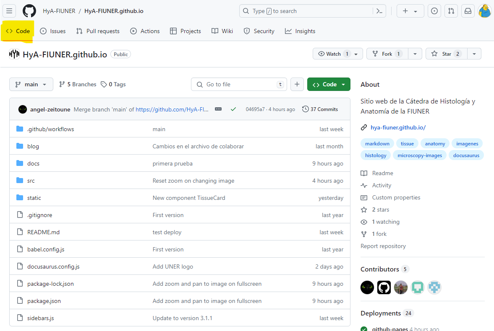
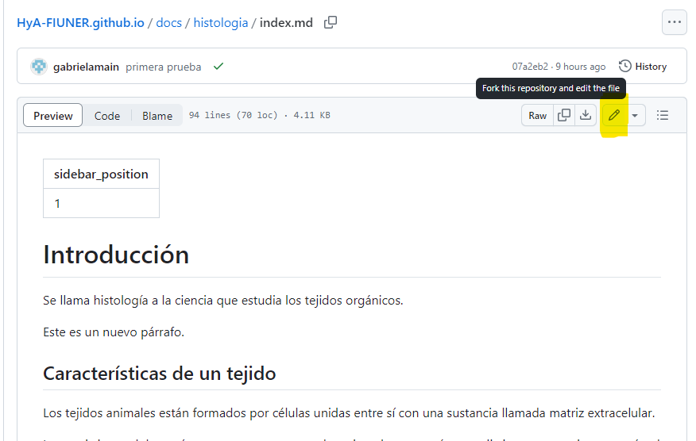
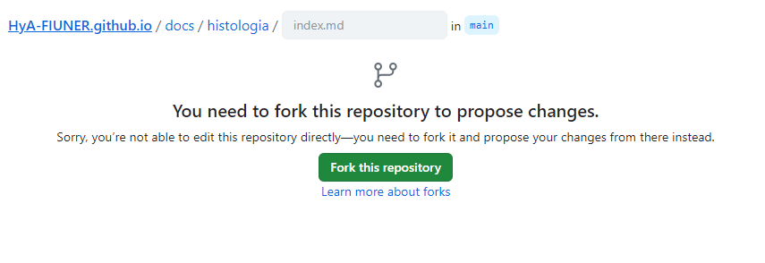
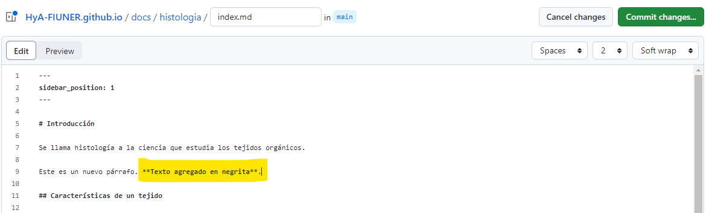
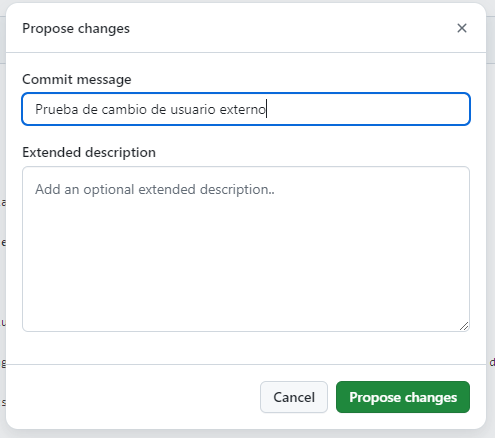
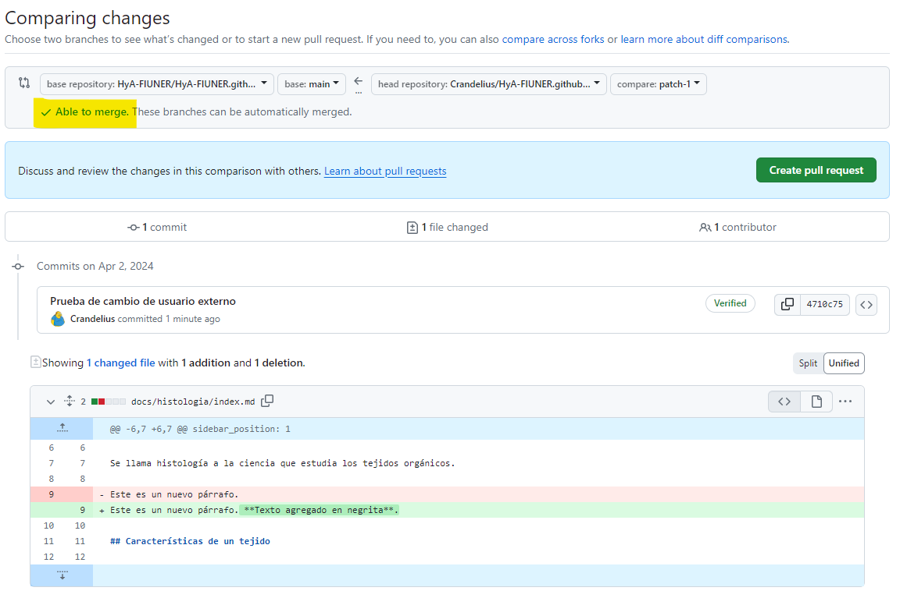
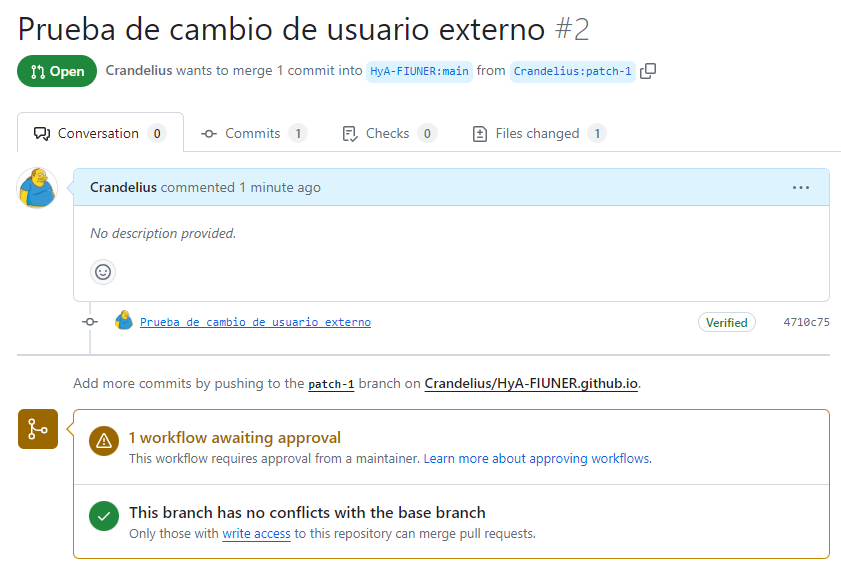

## Introducción

Este sitio ha sido creado y es actualmente mantenido por la Cátedra de Histología y Anatomía de la [FIUNER](http://ingenieria.uner.edu.ar/). Nuestro objetivo es evolucionarlo hacia una plataforma colaborativa donde todos los estudiantes puedan aportar, logrando así enriquecer y organizar el contenido de manera más efectiva y completa para beneficio de todos los interesados en la materia.

Para la construcción de este sitio, se ha utilizado [Docusaurus](https://docusaurus.io), una herramienta de código abierto diseñada para el desarrollo de sitios web modernos. Docusaurus se destaca por su facilidad de configuración y personalización, lo que permite a los usuarios centrar sus esfuerzos en la creación de contenido de calidad. Este contenido se redacta utilizando [Markdown](https://es.wikipedia.org/wiki/Markdown), un lenguaje de marcado que facilita la escritura de documentos de texto con opciones de formato a través de una sintaxis sencilla y legible.

Tanto el código fuente del sitio como el sitio en si mismo, están hospedados en la plataforma [GitHub](https://github.com/). El proyecto ya está configurado de tal manera que cualquier actualización en el contenido se traduce automáticamente en la construcción y publicación de la versión más reciente del sitio. Esta funcionalidad asegura que el sitio se mantenga actualizado y refleje las contribuciones de todos los participantes de manera eficiente.

## Edición del sitio

Aquí te guiaremos a través del método más sencillo para realizar modificaciones en el sitio web, editando un archivo directamente desde la interfaz de GitHub. Este enfoque es especialmente útil para implementar correcciones menores, hacer actualizaciones o añadir contenido, sin la necesidad de una previsualización exhaustiva del cambio. Este proceso es ideal para ajustes rápidos que ayudan a mantener el sitio actualizado y preciso.

### 1. Registro en GitHub

Tal como hemos destacado antes, este proyecto está hospedado en GitHub, por lo tanto, es imprescindible tener una cuenta en GitHub para poder realizar cualquier tipo de modificación o contribución. Para ello, es necesario iniciar el proceso de registro ingresando al sitio [github.com](https://github.com/) donde encontrarás claramente visible la opción para "Registrarse" o "Sign up". Completa el proceso y regresa a esta guía.

### 2. Visita el sitio del proyecto

Accede al proyecto en GitHub a través de [github.com/HyA-FIUNER/HyA-FIUNER.github.io](https://github.com/HyA-FIUNER/HyA-FIUNER.github.io). Al hacerlo, te encontrarás automáticamente en la pestaña **Code**, la cual está seleccionada por defecto. Aquí, podrás explorar todos los archivos y elementos que componen el proyecto, proporcionándote una visión completa de su estructura y contenido actual.

### 3. Selecciona el archivo a modificar

Navega por el repositorio hasta encontrar el archivo que deseas editar y haz clic en el botón **Edit this file** (icono de lápiz) que nos permitirá modificar el archivo en un editor en la misma ventana del navegador. Si es tu primera contribución y no formas parte del equipo del proyecto, deberás hacer los cambios en una copia personal del mismo (mediante un [fork o Bifurcación](https://docs.github.com/es/pull-requests/collaborating-with-pull-requests/working-with-forks/fork-a-repo)) antes de proponer la modificación al proyecto original.

### 4. Crea un fork

Si no eres miembro del proyecto original, necesitarás realizar los cambios en una bifurcación personal del mismo.

### 5. Realiza los cambios

Edita el archivo según consideres necesario. En este ejemplo, agregamos texto en negrita para ilustrar cómo se realiza una edición.

### 6. Guarda los cambios

Guardamos la edición para conservar los cambios presionando el botón verde **Commit changes...**. Se te solicitará ingresar un mensaje descriptivo sobre las modificaciones realizadas.

### 7. Solicita la integración de cambios

Ahora, debes crear una **solicitud de cambio** (Pull request) para que tus modificaciones se consideren para el proyecto original. Verifica que no haya conflictos con la versión actual del proyecto. La confirmación de que es posible integrar los cambios se muestra con el mensaje en verde **Able to merge** :+1:.

Un conflicto puede suceder cuando se intenta modificar una versión vieja de un archivo, es decir, desde el tiempo en que se hizo la copia del proyecto y se realizó la solicitud de cambio otro usuario editó el archivo produciendose un conflicto donde el sistema no esta seguro que versión es la que se debe conservar.

Finalmente, presiona el botón verde **Create pull request** para oficializar tu solicitud de cambio.

### 8. Aprobación del cambio

Un responsable del proyecto revisará tu contribución, y si es aprobada, tu cambio se integrará en el sitio, estando disponible para toda la comunidad.

Si llegaste hasta aca es porque querés o estas realizando tu primera colaboración. GRACIAS. :clap: